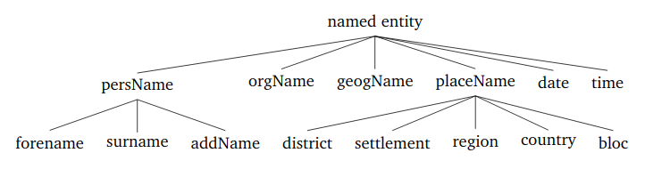

PolDeepNer
==========

About
-----

*PolDeepNer* recognizes mentions of named entities in text using deep learning methods. 
The tool won second place in the PolEval 2018 Task 2 on named entity recognition. 
It contains a pre-trained model trained on the NKJP corpus (nkjp.pl) which recognizes nested annotations of the following types:

  

### Paper

Marcińczuk, Michał; Kocoń, Jan; Gawor, Michał. 
_Recognition of Named Entities for Polish-Comparison of Deep Learning and Conditional Random Fields Approaches_
Ogrodniczuk, Maciej; Kobyliński, Łukasz (Eds.): 
Proceedings of the PolEval 2018 Workshop, pp. 63-73, Institute of Computer Science, 
Polish Academy of Science, Warszawa, 2018.

\[[PDF](https://www.researchgate.net/publication/328429192_Recognition_of_Named_Entities_for_Polish-Comparison_of_Deep_Learning_and_Conditional_Random_Fields_Approaches)\]

<details><summary>[Bibtex]</summary>
<p>

```
@inproceedings{poldeepner2018,
  title     = "Recognition of Named Entities for Polish-Comparison of Deep Learning and Conditional Random Fields Approaches",
  author    = "Marcińczuk, Michał and Kocoń, Jan and Gawor, Michał",
  year      = "2018",
  editor    = "Ogrodniczuk, Maciej and Kobyliński, Łukasz",
  booktitle = "Proceedings of the PolEval 2018 Workshop",
  location  = "Warsaw, Poland",
  pages     = "77--92",
  publisher = "Institute of Computer Science, Polish Academy of Science"
}
```

</p>
</details>

### Credits

BiLSTM and CRF implementation was based on AnaGo (https://github.com/Hironsan/anago)

Contributors
------------

* Michał Marcińczuk <michal.marcinczuk@pwr.edu.pl>
* Jan Kocoń <jan.kocon@pwr.edu.pl>
* Michał Gawor <michal.gawor@pwr.edu.pl>


Installation
------------

### Preparation

Download and/or unpack models (word embeddings, NN pre-trained models):
```bash
sudo apt-get install p7zip-full
```

```bash
./download_unpack.sh
```

### Using Docker

Build Docker image:
```bash
./build.sh
```

Run Docker image in the interactive mode:
```bash
./run.sh
```

### Using virtual environment

```bash
sudo apt-get install python3-pip python3-dev python-virtualenv
sudo pip install -U pip
virtualenv --system-site-packages -p python3.5 venv
source venv/bin/activate
pip install -U pip

pip install seqeval
pip install keras
pip install tensorflow-gpu
pip install git+https://www.github.com/keras-team/keras-contrib.git
pip install cython
pip install pyfasttext
pip install fasttext
pip install sklearn
pip install python-dateutil
pip install nltk
```


Evaluation (using Docker)
----------

### Process set of document and generate a json file

The evalation corpus in json format was split into a set of separate files. 
Then each of the documents was tagged using WCRFT tagger and four files were generated:
* NAME.txt — file content,
* NAME.ini — ini file with document original name,
* NAME.xml — ccl file containing tagging output,
* NAME.iob — ccl file converted to iob format. 

Run Docker

```bash
./run.sh
```

Generate json file for the evaluation corpus:
```bash
python3.6 core/process_poleval.py \
            -i data/poleval2018ner-data/index_iob.list \
            -o data/poldeepner-output.json \
            -m model
```

Run the official evaluation script:
```bash
python3.6 core/poleval_ner_test.py \
             -g data/POLEVAL-NER_GOLD.json \
             -u data/poldeepner-output.json
```

Output:
```bash
OVERLAP precision: 0.918 recall: 0.815 F1: 0.864 
EXACT precision: 0.860 recall: 0.764 F1: 0.809 
Final score: 0.853
```
 

Processing
----------

### Interactive test

*Disclaimer:* the current version of the script uses NLTK tokenizer which is not fully compatible with the training data used to train the model.
The final version of the script should use *toki* tokenizer or *WCRFT* tagger. 

Run inside Docker:

```bash
python3.6 core/interactive_test.py
```

Enter text to process:

```bash
Enter text to process:
```

```bash
Enter text to process: XXXIII konwent fanów fantastyki Polcon trwał przez 4 dni: od 12 do 15 sierpnia 2018 na terenie Miasteczka Akademickiego Uniwersytetu Mikołaja Kopernika w Toruniu.
```

Output:
```bash
[ 32: 38] orgName              Polcon
[ 61: 63] date                 12
[ 67: 83] date                 15 sierpnia 2018
[ 95:151] geogName             Miasteczka Akademickiego Uniwersytetu Mikołaja Kopernika
[154:161] placeName_settlement Toruniu
```


To exit press Enter without typing any text.

Training
--------
Run virtual environment.

```bash
source venv/bin/activate
```

Train each model separately. The training will replace the pre-trained models. 
```bash
python poldeepner/core/trainmodel.py \
              -i poldeepner/data/nkjp-nested-simplified-v2.iob \
              -t poldeepner/data/nkjp-nested-simplified-v2.iob \
              -f poldeepner/model/cc.pl.300.bin \
              -m poldeepner/model/poldeepner-nkjp-ftcc-bigru \
              -e 15 -n GRU
                          
python poldeepner/core/trainmodel.py \
              -i poldeepner/data/nkjp-nested-simplified-v2.iob \
              -t poldeepner/data/nkjp-nested-simplified-v2.iob \
              -f poldeepner/model/kgr10_orths.vec.bin \
              -m poldeepner/model/poldeepner-nkjp-ftkgr10orth-bigru \
              -e 15 -n GRU -s 100
                          
python poldeepner/core/trainmodel.py \
              -i poldeepner/data/nkjp-nested-simplified-v2.iob \
              -t poldeepner/data/nkjp-nested-simplified-v2.iob \
              -f poldeepner/model/kgr10-plain-sg-300-mC50.bin \
              -m poldeepner/model/poldeepner-nkjp-ftkgr10plain-lstm \
              -e 15 -n LSTM
```

Before training the structure of the NN will be printed:
```bash
Layer (type)                 Output Shape              Param #   
=================================================================
word_input (InputLayer)      (None, None, 100)         0         
_________________________________________________________________
dropout_1 (Dropout)          (None, None, 100)         0         
_________________________________________________________________
bidirectional_1 (Bidirection (None, None, 200)         120600    
_________________________________________________________________
dense_1 (Dense)              (None, None, 100)         20100     
_________________________________________________________________
crf_1 (CRF)                  (None, None, 41)          5904      
=================================================================
Total params: 146,604
Trainable params: 146,604
Non-trainable params: 0
_________________________________________________________________
```

After every epoch a table with accuracy of the current model will be printed. Below is a sample table after the first epoch.

```bash
2677/2677 [==============================] - 234s 87ms/step - loss: 0.0762
 - f1: 74.68
annotation                  TP      FP      FN precision    recall  f1-score   support
date                      3365     647    1133     83.87     74.81     79.08      4498
geogName                  1102     417    3040     72.55     26.61     38.93      4142
orgName                   6714    2867    4444     70.08     60.17     64.75     11158
persName                 16165    2495    3773     86.63     81.08     83.76     19938
persName_addName             0       0     949      0.00      0.00      0.00       949
persName_forename        11271    1138    1683     90.83     87.01     88.88     12954
persName_surname         11351    2035    1266     84.80     89.97     87.31     12617
placeName                    0       0     368      0.00      0.00      0.00       368
placeName_bloc               0       0     100      0.00      0.00      0.00       100
placeName_country         6172    1437    1324     81.11     82.34     81.72      7496
placeName_district           0       0     279      0.00      0.00      0.00       279
placeName_region             0       0     760      0.00      0.00      0.00       760
placeName_settlement      5796    2055    1984     73.82     74.50     74.16      7780
time                       147      45     417     76.56     26.06     38.89       564

TOTAL                    62083   13136   21520     82.54     74.26     78.18     83603
```


License
-----
Copyright (C) Wrocław University of Science and Technology (PWr), 2010-2018. All rights reserved.

This program is free software: you can redistribute it and/or modify it under the terms of the GNU General Public License as published by the Free Software Foundation, either version 3 of the License, or (at your option) any later version.

This program is distributed in the hope that it will be useful, but WITHOUT ANY WARRANTY; without even the implied warranty of MERCHANTABILITY or FITNESS FOR A PARTICULAR PURPOSE. See the GNU General Public License for more details.

You should have received a copy of the GNU General Public License along with this program. If not, see http://www.gnu.org/licenses/.